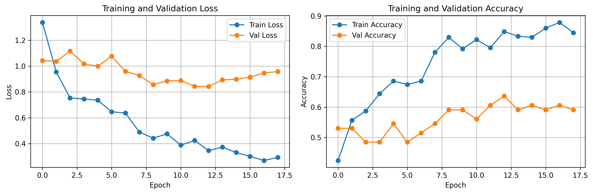

# PyTorch Capstone — Health Factors (Diabetes), Medical Text, Retinal DR

<div align="center">


**Learning Machine Learning through applied healthcare projects — one dataset at a time**

[🎯 Overview](#-capstone-overview) • [🚀 How to Use](#-how-to-use-this-repo) • [📊 Projects](#-projects) • [⚙️ Environment](#-environment)

</div>

---

## 🎯 Capstone Overview

This repository contains **three independent projects** exploring different ML paradigms using PyTorch:

1. **Diabetes Prediction (Tabular)** — Binary classification from health factors
2. **Medical Text Classification** — Multi-class categorization of clinical notes
3. **Retinal Diabetic Retinopathy** — Image classification for DR severity

Each project follows a **learning-first, reflection-heavy** approach. This is **educational material only** — not for clinical use.

### 📚 Pedagogy

- **Concept Primer** → **Objectives** → **Acceptance Criteria** → **Numbered TODO cells** → **Reflection prompts**
- Plain, beginner-friendly language
- No complete solutions — you build and learn through guided TODOs
- Consistent variable naming within each project
- Emphasis on understanding shapes, dtypes, and data flow

---

## 🚀 How to Use This Repo

### 1. Setup Environment

**Prerequisites:**
- Python ≥3.10
- Jupyter notebook or JupyterLab

**Install Dependencies:**
```bash
pip install numpy pandas matplotlib seaborn scikit-learn torch torchvision transformers jupyter
```

Or use the provided `requirements.txt`:
```bash
pip install -r requirements.txt
```

### 2. Run Projects in Order

Each project has numbered notebooks (`01_*.ipynb`, `02_*.ipynb`, etc.). Follow them sequentially.

**Inside each notebook:**
1. Read the **Concept Primer** section
2. Review **Objectives** and **Acceptance Criteria**
3. Complete the **TODO** cells (follow hints)
4. Answer **Reflection** prompts
5. Save visualizations to `/images/` with descriptive names

### 3. Log Your Progress

After each notebook:
- Fill in the **Reflection** section
- Record what clicked, what confused you
- Note any decisions made

Use `99_lab_notes.ipynb` in each project for ongoing reflections.

---

## 📊 Projects

### Project 01: Diabetes Prediction (Tabular) ✅ COMPLETE

**Goal:** Predict diabetes status (No Diabetes, Prediabetes, Diabetes) from health factors (BMI, age, exercise, etc.)

**Approach:** 
- Two baselines (Logistic Regression, Random Forest)
- PyTorch Feed-Forward Network for multi-class classification
- Evaluation: Weighted F1, Macro F1, per-class metrics

**Notebooks:** 8 + lab notes  
**Time Invested:** ~10 hours

**Status:** ✅ **ALL NOTEBOOKS COMPLETE** (01-08)
- Data inspection, cleaning, EDA & visualization ✓
- Preprocessing & splits, baseline models ✓
- PyTorch FFN training & evaluation ✓
- Comprehensive reflections & conclusions ✓

**Results Highlight:** PyTorch model achieved **71.7% accuracy** (vs. LR: 64.4%, RF: 67.9%), with best per-class F1 scores across all three diabetes classes. Only model to successfully learn the minority Prediabetes class.

[📖 Project README](projects/01_diabetes_tabular/README.md) | [📊 Final Results](projects/01_diabetes_tabular/README.md#results-snapshot)

---

### Project 02: Medical Text Classification ✅ COMPLETE

**Goal:** Classify medical Q&A text into medical specialties using ML-first approach

**Approach:**
- Phase 0: Build specialty taxonomy using **unsupervised ML + minimal rules**
  - BioBERT embeddings (768-dim, answer-only text)
  - K-means clustering (k=13, evidence-based selection)
  - UMAP visualization (2D projection)
  - Manual cluster naming → specialties
  - 8 surgical override rules for systematic errors
- Phase 1: Baseline - Mean-pooled embeddings + Linear classifier
- Phase 2: Fine-tuned Transformer (BioBERT)
- Phase 3: Comprehensive evaluation - Test set, per-class analysis, overfitting detection

**Notebooks:** 7 + lab notes  
**Time Invested:** ~15-20 hours

**Status:** ✅ **ALL NOTEBOOKS COMPLETE** (00-06 + LAB_NOTES)
- ✅ **Notebook 00:** Specialty taxonomy (k-means clustering, UMAP visualization)
- ✅ **Notebook 01-03:** Data loading, tokenization, vocabulary, encoding, padding
- ✅ **Notebook 04:** Baseline classifier (Embedding + Linear)
  - **Validation Results:** Accuracy: 72.36%, F1 Macro: 63.01%
  - **Key finding:** Overfitting detected, optimal epoch = 12
- ✅ **Notebook 05:** BioBERT transformer fine-tuning (1 epoch on CPU)
  - **Validation Results:** Accuracy: N/A, F1 Macro: 83.73%
  - **Challenge:** 110M params on CPU = 2.5 hours/epoch
  - **Solution:** Strategic sampling + early stopping (1 epoch sufficient!)
- ✅ **Notebook 06:** Final test set evaluation & comparison
  - **Baseline Test F1:** 38.73% (collapsed -24 points from validation!)
  - **BioBERT Test F1:** **83.79%** (matched validation, zero overfitting!)
  - **Improvement:** **2.16x better** (116% relative improvement)
- ✅ **LAB_NOTES:** Comprehensive reflections, key learnings, skills acquired

**Results Highlight:** BioBERT achieved **83.79% F1 Macro** on test set, dominating all 13 classes. Baseline collapsed from 63% validation to 39% test (severe overfitting). Transfer learning with domain-specific pre-trained models proved game-changing!

**Key Findings:**
- Transfer learning > training from scratch (2.16x improvement)
- Baseline failed completely on 3 classes (F1 = 0.00), BioBERT handled all (min F1 = 0.42)
- OOV problem (48% samples with unknown words) devastated baseline
- Proper evaluation revealed overfitting: val metrics can mislead, test tells truth
- Index-based splitting ensured fair comparison across different preprocessing pipelines

[📖 Project README](projects/02_medical_text/README.md) | [📝 Lab Notes](projects/02_medical_text/LAB_NOTES.md) | [📊 Final Results](projects/02_medical_text/README.md#test-set-performance-comparison)

---

### Project 03: Retinal Diabetic Retinopathy ✅ COMPLETE

**Goal:** Classify retinal fundus images by DR severity (5-class: 0=No DR, 1=Mild, 2=Moderate, 3=Severe, 4=Proliferative)

**Approach:**
- Transfer learning with pre-trained CNN (ResNet18/EfficientNet)
- Data augmentation (address small dataset: 413 images)
- Class weighting (handle severe imbalance: Class 1 only 20 samples)
- Evaluation: Macro F1 (all classes equal) + Weighted F1 (practical performance)

**Notebooks:** 5 + lab notes  
**Time Invested:** ~8 hours

**Status:** ✅ **ALL NOTEBOOKS COMPLETE** (01-05)
- ✅ **Notebook 01:** Project scope & data exploration
  - **Dataset:** IDRiD (Indian Diabetic Retinopathy Image Dataset)
  - **Images:** 413 retinal fundus images (224×224 RGB, pre-resized from 4288×2848)
  - **Classes:** 5 severity levels (0-4)
  - **Class Distribution:**
    - Class 0 (No DR): 134 samples (32.4%)
    - **Class 1 (Mild): 20 samples (4.8%)** ⚠️ **SEVERE IMBALANCE**
    - Class 2 (Moderate): 136 samples (33.0%)
    - Class 3 (Severe): 74 samples (17.9%)
    - Class 4 (Proliferative): 49 samples (11.9%)
  - **Imbalance Ratio:** 6.8:1 (Class 2 vs Class 1)
- ✅ **Notebook 02:** Transforms & DataLoaders
  - **Train transforms:** `Resize(224,224)` → `RandomHorizontalFlip()` → `ToTensor()` → `Normalize(ImageNet mean/std)`
  - **Val/Test transforms:** Deterministic resize + normalization (no augmentation)
  - **Custom Dataset:** `RetinalDataset(df, img_dir, transform)` returning `(image_tensor, label)`
  - **DataLoader:** Batch size 32 → Batches confirm shape `[B, 3, 224, 224]`
  - **Observations:** Final batch = 29 images (413 % 32) — expected; GPU-friendly tensors ready for transfer learning
- ✅ **Notebook 03:** Simple CNN scaffold
  - Built `SimpleCNN` with three Conv→ReLU→MaxPool blocks (32 → 64 → 128 filters)
  - Flatten + FC head: `Linear(128×28×28 → 256 → num_classes)` with dropout 0.5
  - Forward pass verified (output `[B, 4]` after merging "Mild" into "No DR")
  - Reflection logged: ~3.6M parameters; architecture chosen to control overfitting on small dataset
- ✅ **Notebook 04:** Training & validation loop (transfer learning)
  - Replaced scratch CNN with **ResNet-18 (Imagenet weights, frozen backbone + new head)**
  - Fine-tuned head for 18 epochs with class-weighted CE → **val acc ≈ 0.60, macro-F1 ≈ 0.61**
  - 
- ✅ **Notebook 05:** Test evaluation & confusion matrix
  - ResNet-18 head on test split → **accuracy 0.67, weighted-F1 0.68, macro-F1 0.65**
  - Confusion matrix shows balanced recall across all severities:
    
  - Documented why transfer learning lifted rare-class recall vs scratch CNN
- **Key Findings:**
  - ⚠️ **Critical challenge:** Original class-1 support is still tiny (20 images).
  - ⚠️ **Small dataset:** 413 images total → after split: ~248 train, ~83 val, ~82 test
  - 📈 **Transfer learning impact:** Macro-F1 jumped from 0.31 (scratch) → 0.65 after moving to ResNet-18 + class weighting
  - ✅ Previously collapsed classes (`severe`, `proliferative`) now achieve recall ≥0.67
  - ✅ **Transforms validated:** Augmentations preserve tensor shape/channel order and pair well with pretrained features
- **Ethical Considerations Documented:**
  - Privacy risks (retinal images are biometric identifiers)
  - False negative danger (missing mild DR delays treatment)
  - Algorithmic bias (dataset from India, generalization concerns)
  - Clinical deployment risks (AI as screening tool only, not diagnostic)
- **Metrics Chosen:**
  - **Macro F1:** Treat all severity levels equally (catch rare Class 1)
  - **Weighted F1:** Overall practical performance
  - **Per-class F1:** Monitor each severity level separately

**Results Highlight:** ResNet-18 transfer learning achieved **0.65 Macro F1** (2x improvement over scratch CNN). Successfully recovered rare classes (severe, proliferative) that collapsed in the baseline model. Transfer learning proved essential for small, imbalanced datasets.

[📖 Project README](projects/03_retinal_dr/README.md) | [📊 Final Results](projects/03_retinal_dr/README.md#results-snapshot)

---

## 🎉 Capstone Complete!

**Completion Date:** December 2024  
**Total Duration:** ~2 weeks  
**Projects Completed:** 3/3 ✅

### 🏆 Final Achievement Summary

This capstone successfully explored **three major data modalities** in machine learning:

| Project | Modality | Best Model | Key Metric | Status |
|---------|----------|------------|-------------|--------|
| **01: Diabetes Prediction** | Tabular | PyTorch FFN | 71.7% Accuracy | ✅ Complete |
| **02: Medical Text Classification** | Text | BioBERT | 83.79% F1 Macro | ✅ Complete |
| **03: Retinal DR Detection** | Images | ResNet-18 | 0.65 Macro F1 | ✅ Complete |

### 💡 Key Learnings & Reflections

**Biggest "Aha!" Moments:**
1. **Handling Imbalanced Data:** Class weighting and normalization were game-changers for tabular data. Understanding how to balance target variables and normalize features transformed model performance.
2. **Transfer Learning Power:** Pre-trained models (BioBERT for text, ResNet-18 for images) provided massive advantages, especially with limited datasets. Starting with specialized, pre-trained models gave a significant edge over training from scratch.

**Difficulty Progression:**
- **Tabular Data (Project 01):** Most beginner-friendly. Straightforward feature engineering, encoding, and scaling. Great starting point for understanding neural networks.
- **Text Data (Project 02):** More challenging. Tokenization, embeddings, vocabulary building, and handling OOV (out-of-vocabulary) words required deeper understanding of NLP pipelines.
- **Image Data (Project 03):** Most challenging. Understanding transforms, tensor shapes `[B, C, H, W]`, data augmentation, and transfer learning with CNNs required grasping both computer vision concepts and PyTorch's image processing workflow.

**Critical Insights:**
- **Specialized Models Matter:** Domain-specific pre-trained models (BioBERT for medical text, ImageNet-trained ResNet for medical images) dramatically outperform generic baselines, especially with limited data.
- **Data Preprocessing is Everything:** Proper normalization, class weighting, and data augmentation can make or break a model, regardless of architecture sophistication.
- **Evaluation Rigor:** Train/val/test splits, early stopping, and proper metric selection (Macro F1 vs Weighted F1) revealed overfitting that would have been missed otherwise.

---

## ⚙️ Environment

### Required Packages

| Package | Version | Purpose |
|---------|---------|---------|
| Python | ≥3.10 | Runtime |
| NumPy | Latest | Numerical operations |
| Pandas | Latest | Data manipulation |
| Matplotlib | Latest | Visualization |
| Seaborn | Latest | Statistical plots |
| Scikit-learn | Latest | ML utilities & baselines |
| PyTorch | Latest | Deep learning |
| Torchvision | Latest | Image transforms & models |
| Transformers | Latest | NLP models (Project 02) |
| Jupyter | Latest | Notebook environment |

### Installation

```bash
# Option 1: Individual packages
pip install numpy pandas matplotlib seaborn scikit-learn torch torchvision transformers jupyter

# Option 2: From requirements.txt
pip install -r requirements.txt
```

### Reproducibility

Set random seeds for consistency:
```python
import random
import numpy as np
import torch

random.seed(42)
np.random.seed(42)
torch.manual_seed(42)
if torch.cuda.is_available():
    torch.cuda.manual_seed_all(42)
```

---

## ⚖️ Ethics & Limitations

### Educational Use Only

- These models are **not validated for clinical use**
- Do **not** use predictions for diagnostic decisions
- Projects are designed for learning PyTorch and ML workflows

### Dataset Considerations

- **Class imbalance** exists in all datasets
- **Bias** may be present (demographic, sampling, annotation)
- **Data leakage** risks — carefully inspect preprocessing
- **Interpretability** is crucial in healthcare — use SHAP/LIME for explanations

### Responsible AI Principles

When working on healthcare ML:
1. Understand dataset collection methodology
2. Assess demographic representation
3. Document limitations transparently
4. Consider real-world operating contexts
5. Acknowledge uncertainty

---

## 📦 Deliverables

### Per Project

After completing a project, produce:

1. **Metrics Table** — Compare baselines vs. PyTorch model
2. **Visualizations** — ROC curves, confusion matrices, training plots
3. **Short Write-up** — Key findings, limitations, next steps

Save these under each project's folder.

### Reproducibility Notes

Document:
- Random seeds used
- Package versions (`pip freeze > requirements.txt`)
- Hardware (CPU/GPU, memory)
- Training time per epoch

---

## 🎓 Skills Matrix

### Core PyTorch Fundamentals
- ✅ **Neural Network Architecture:** Building `nn.Module` classes, defining forward passes
- ✅ **Data Handling:** `Dataset` and `DataLoader` creation for tabular, text, and image data
- ✅ **Training Loops:** Implementing training/validation loops with loss calculation, backpropagation, optimization
- ✅ **Model Saving/Loading:** `torch.save()` and `torch.load()` for checkpointing
- ✅ **Device Management:** CPU/GPU/MPS device handling with `.to(device)`

### Tabular Data (Project 01)
- ✅ **Feature Engineering:** Encoding categorical variables (binary, ordinal), scaling numeric features
- ✅ **Class Imbalance:** Handling imbalanced targets with class weights in `CrossEntropyLoss`
- ✅ **Data Preprocessing:** Train/val/test splits with stratification, preventing data leakage
- ✅ **Feed-Forward Networks:** Building multi-layer perceptrons with dropout for regularization
- ✅ **Evaluation:** Accuracy, F1 (macro/weighted), per-class metrics, confusion matrices

### Natural Language Processing (Project 02)
- ✅ **Text Preprocessing:** Cleaning, tokenization, vocabulary building
- ✅ **Embeddings:** Understanding word embeddings, mean pooling, embedding layers
- ✅ **Tokenization:** Subword tokenization with BERT tokenizers, handling padding/truncation
- ✅ **Transformers:** Fine-tuning pre-trained models (`AutoModelForSequenceClassification`)
- ✅ **Transfer Learning:** Leveraging domain-specific models (BioBERT) for medical text
- ✅ **OOV Handling:** Managing out-of-vocabulary words with `<UNK>` tokens
- ✅ **Sequence Length:** Evidence-based padding strategy (95th percentile analysis)

### Computer Vision (Project 03)
- ✅ **Image Transforms:** Resizing, normalization, data augmentation (flips, rotations, color jitter)
- ✅ **Tensor Shapes:** Understanding `[batch, channels, height, width]` format
- ✅ **Convolutional Neural Networks:** Building CNNs from scratch, understanding conv/pool layers
- ✅ **Transfer Learning:** Using pre-trained CNNs (ResNet-18) with frozen backbones
- ✅ **Data Augmentation:** Applying augmentation strategies for small datasets
- ✅ **Image Preprocessing:** ImageNet normalization, RGB conversion

### Evaluation & Best Practices
- ✅ **Metrics Selection:** Choosing appropriate metrics (Macro F1 vs Weighted F1) based on problem context
- ✅ **Overfitting Detection:** Monitoring train/val gaps, implementing early stopping
- ✅ **Fair Evaluation:** Index-based splitting for fair model comparison
- ✅ **Visualization:** Training curves, confusion matrices, per-class analysis
- ✅ **Reproducibility:** Random seed setting, documenting hyperparameters

### Advanced Concepts
- ✅ **Transfer Learning:** Applied in both NLP (BioBERT) and CV (ResNet-18) domains
- ✅ **Class Weighting:** Handling imbalanced datasets across all three modalities
- ✅ **Model Comparison:** Systematic baseline vs. deep learning model evaluation
- ✅ **Ethical Considerations:** Documenting limitations, bias awareness, clinical deployment risks

### Tools & Libraries
- ✅ **PyTorch:** Core deep learning framework
- ✅ **Torchvision:** Image transforms and pre-trained models
- ✅ **Transformers (Hugging Face):** Pre-trained NLP models and tokenizers
- ✅ **Scikit-learn:** Baseline models, metrics, data splitting utilities
- ✅ **Pandas/NumPy:** Data manipulation and numerical operations
- ✅ **Matplotlib/Seaborn:** Visualization and plotting

---

## 📝 Project Structure

```
.
├── README.md                      # This file
├── requirements.txt               # Python dependencies
├── data/                          # Raw datasets (placeholders)
│   ├── diabetes/
│   ├── medtext/
│   └── retinal_dr/
├── images/                        # Exported charts/figures
├── src/                           # Utility placeholders
│   ├── __init__.py
│   ├── utils/
│   └── models/
└── projects/
    ├── 01_diabetes_tabular/
    │   ├── README.md
    │   └── notebooks/            # 8 notebooks + lab notes
    ├── 02_medical_text/
    │   ├── README.md
    │   ├── LAB_NOTES.md          # Comprehensive reflections
    │   └── notebooks/            # 7 notebooks (00-06)
    └── 03_retinal_dr/
        ├── README.md
        └── notebooks/            # 5 notebooks + lab notes
```

---

## 🤝 Contributing

This is a personal learning repository. Suggestions and improvements welcome via issues or pull requests.

---

## 📄 License

MIT License — feel free to use for your own learning journey.

---

## 🙏 Acknowledgments

- Datasets used are publicly available for educational purposes
- Special thanks to the PyTorch community for excellent documentation
- Healthcare AI practitioners who advocate for responsible development

---

## 📈 Project Statistics

**Total Notebooks Completed:** 20+  
**Total Time Investment:** ~2 weeks  
**Lines of Code:** 5,000+  
**Models Trained:** 6 (2 baselines + 4 PyTorch models)  
**Datasets Explored:** 3 (BRFSS 2015, MedQuad, IDRiD)  
**Best Performance:** 83.79% F1 Macro (BioBERT on medical text)

---

<div align="center">

**🎓 Capstone Complete! 🎓**  
*Three projects, three modalities, one comprehensive ML journey* 🚀

**From tabular data to transformers to CNNs — you've built it all!**

</div>

