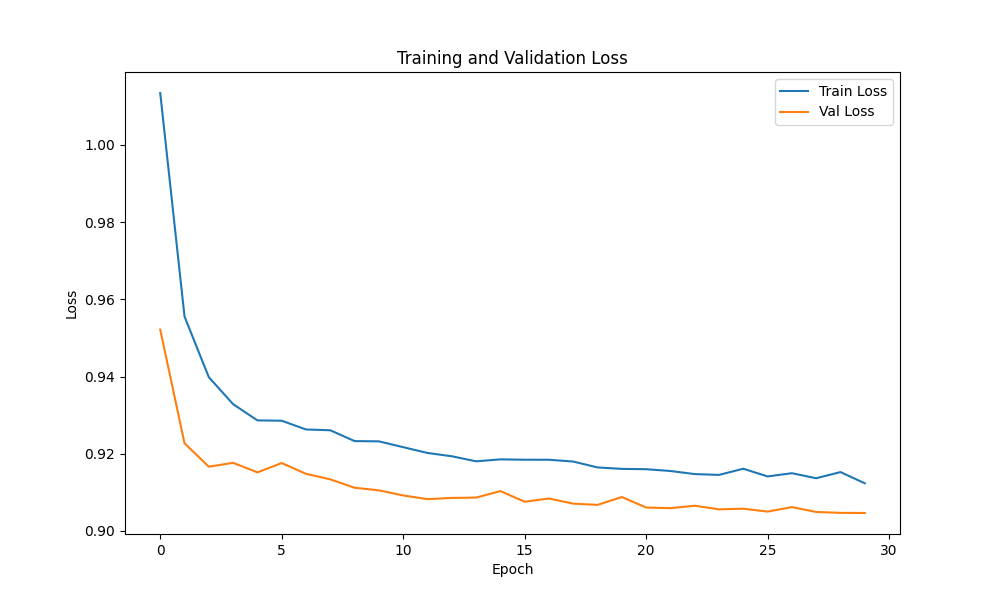

# Project 01: Diabetes Prediction (Tabular Data)

## Problem Statement & Success Metrics

### Problem
Predict diabetes status (**trinary classification**: No Diabetes, Prediabetes, Diabetes) from health factors including BMI, age, exercise habits, and other demographic/clinical variables.

### Questions to Explore
- Which health factors are most predictive of diabetes status?
- Can we achieve acceptable screening performance across all three classes?
- How do classical baselines compare to a neural network?
- How to handle severe class imbalance (84% vs 14% vs 2%)?

### Success Metrics
- **Primary:** Macro-averaged F1-score ≥ 0.60
- **Secondary:** Weighted ROC-AUC ≥ 0.75 (multi-class)
- **Per-class Performance:** Focus on minority classes (Prediabetes, Diabetes)
- **Interpretability:** Feature importance analysis

---

## Data Description

### Source
- **Dataset:** Diabetes BRFSS 2015 (CDC Behavioral Risk Factor Surveillance System)
- **Location:** `../data/diabetes_BRFSS2015.csv`
- **Size:** 253,680 records × 22 columns

### Key Fields
- **Target:** Diabetes (trinary classification: No Diabetes, Prediabetes, Diabetes)
- **Features:** Age, BMI, exercise, education, income, health status, etc.
- **Type:** Mixed (numeric + categorical)

### Target Distribution

The dataset has a **trinary diabetes classification** with severe class imbalance:

| Class | Label | Count | Percentage |
|-------|-------|-------|------------|
| 0 | No Diabetes | 213,703 | 84% |
| 1 | Prediabetes | 4,631 | 2% |
| 2 | Diabetes | 35,346 | 14% |

**Key Observations:**
- Extreme imbalance (84% vs 14% vs 2%)
- Requires stratified sampling for train/val/test splits
- May need class weights or resampling techniques during training
- Focus on metrics beyond accuracy (F1, precision, recall, ROC-AUC)

### Data Quality
- **Missing Values:** None detected ✅
- **Data Types:** 4 numeric (BMI, GenHlth, MentHlth, PhysHlth), 18 object columns
- **Schema Issues:** Many object columns need encoding (Yes/No, categorical variables)

---

## Method Overview

### Baseline Models
1. **Logistic Regression** — Linear baseline with class weights
2. **Random Forest** — Non-linear baseline with feature importance

### PyTorch Model
- **Architecture:** Feed-Forward Network (FFN)
- **Layers:** Input → Hidden(s) → Dropout → Output
- **Loss:** CrossEntropyLoss (for multi-class classification)
- **Training:** Adam optimizer, early stopping, validation monitoring
- **Handling Imbalance:** Class weights or stratified sampling

### Evaluation
- **Metrics:** 
  - Macro-averaged: Precision, Recall, F1 across all classes
  - Weighted averages (accounts for class imbalance)
  - Per-class metrics (especially for minority classes)
- **Visualizations:** Multi-class confusion matrix, per-class ROC curves
- **Special Considerations:** Class imbalance handling strategies (class weights, stratified sampling)

---

## How to Run

### Prerequisites
- Complete root-level setup (see main README)
- Install dependencies: `pip install -r requirements.txt`

### Notebook Order
1. `01_project_goals_and_data.ipynb` — Define problem & metrics
2. `02_load_and_inspect.ipynb` — Load data, check dtypes, visualize target
3. `03_cleaning.ipynb` — Handle missing values, outliers, rename columns
4. `04_eda_visualization.ipynb` — Exploratory analysis, correlations
5. `05_preprocessing_splits_balance.ipynb` — Encode, scale, split, handle imbalance
6. `06_baselines_logreg_rf.ipynb` — Train & evaluate baselines
7. `07_pytorch_ffn_build_train.ipynb` — Build & train neural network
8. `08_evaluation_and_conclusions.ipynb` — Final evaluation & write-up
9. `99_lab_notes.ipynb` — Reflections (ongoing)

### Expected Outputs
- **Data:** Cleaned DataFrame in memory after notebook 03
- **Features:** Encoded/scaled train/val/test splits after notebook 05
- **Models:** Trained objects in memory
- **Metrics:** Tables comparing all models
- **Plots:** ROC curves, confusion matrices, training curves

---

## Progress Status

### ✅ Completed
- [x] **Project Goals & Data** (Notebook 01) — Problem definition and metrics established
- [x] **Load and Inspect** (Notebook 02) — Data loaded, schema analyzed, class distribution documented
  - Dataset: 253,680 rows × 22 columns
  - Trinary classification confirmed (No Diabetes, Prediabetes, Diabetes)
  - Severe class imbalance identified (84% / 14% / 2%)
  - No missing values detected
  - Schema issues identified (18 object columns need encoding)
- [x] **Cleaning** (Notebook 03) — Data cleaned and outliers handled
  - Columns renamed to snake_case
  - Categorical variables intentionally kept as objects for proper encoding later
  - BMI extreme outliers capped at 60 (physiologically reasonable upper limit)
  - MentHlth and PhysHlth verified as valid skewed distributions (0-30 days)
  - GenHlth verified within valid range (1-5)
- [x] **EDA & Visualization** (Notebook 04) — Exploratory analysis completed
  - Correlation heatmap: GenHlth ↔ PhysHlth (0.52), MentHlth ↔ PhysHlth (0.35)
  - BMI distributions differ significantly across diabetes groups
  - General health ratings worsen from no diabetes (2) → prediabetes/diabetes (3-4)
  - Surprising finding: Prediabetes shows highest physical health burden
  - 8 visualizations generated and saved
- [x] **Preprocessing & Splits** (Notebook 05) — Data prepared for modeling
  - Data split: 70/15/15 (train/val/test) with stratification
  - Binary encoding: 13 Yes/No columns → 0/1
  - Ordinal encoding: age, education, income (preserving order)
  - StandardScaler applied to numeric features (BMI, health measures)
  - Class weights computed: {0: 0.396, 1: 18.26, 2: 2.39}
  - Final feature count: 21 features, all numeric
  - Data leakage prevention verified
- [x] **Baseline Models** (Notebook 06) — Logistic Regression & Random Forest trained
  - Logistic Regression: 64.4% accuracy, F1 weighted: 0.719
  - Random Forest: 67.9% accuracy, F1 weighted: 0.734 (winner)
  - Both models struggle with prediabetes (2% of data): 13-31% recall
  - ROC-AUC: ~0.815 for both models
  - Key insight: Severe class imbalance limits baseline performance
  - Realistic PyTorch target: 70-75% accuracy, F1 macro: 0.50-0.60
- [x] **PyTorch Model** (Notebook 07) — Feed-forward network built and trained
  - Architecture: 21 → 256 → 128 → 64 → 3 (4-layer FFN with dropout 0.3)
  - Optimizer: SGD with momentum (0.9), learning rate: 0.0001
  - Training: 30 epochs, convergence at ~25 epochs
  - Loss: Train 1.01→0.91 (10% improvement), Val 0.95→0.90
  - Class weights applied to handle imbalance
  - No overfitting detected (train/val gap < 0.02)
  - Model saved to `models/diabetes_ffn_best.pth`
  - Key learning: SGD outperformed Adam for this imbalanced problem
- [x] **Evaluation & Conclusions** (Notebook 08) — Final model comparison and analysis
  - PyTorch model achieved **71.7% accuracy** (best among all models)
  - PyTorch F1 weighted: **0.7368** (vs. LR: 0.7194, RF: 0.7336)
  - PyTorch F1 macro: **0.4799** (vs. LR: 0.4287, RF: 0.4289)
  - **Only model with non-zero F1 for Prediabetes class (0.13)**
  - Confusion matrix comparison reveals pattern: all models struggle with minority class
  - Comprehensive reflection on clinical implications and next steps documented
  - **Project status: ✅ COMPLETE**

---

## 📊 Visual Highlights

### Feature Correlations

*Correlation heatmap showing relationships between numeric features. Strongest correlation: GenHlth ↔ PhysHlth (0.52)*

### BMI Distribution by Diabetes Status

*Clear separation: No Diabetes (lower BMI) vs. Diabetes/Prediabetes (higher BMI with larger spread)*

### General Health by Diabetes Status

*Progressive health decline: No Diabetes (~2) → Prediabetes (~3) → Diabetes (~3.5-4)*

### PyTorch Training Curves

*Neural network training progress over 30 epochs. Rapid initial learning (epochs 1-5) followed by gradual convergence. No overfitting - train and validation losses track closely throughout.*

### Model Comparison: Confusion Matrices

*Side-by-side comparison of confusion matrices for all three models. PyTorch achieves the highest accuracy (71.7%) and best per-class performance. All models struggle with Prediabetes (Class 1) due to extreme class imbalance (~2% of dataset).*

---

## Results Snapshot

### Final Metrics (Test Set Performance)

| Model | Accuracy | Weighted F1 | Macro F1 | Class 0 F1 | Class 1 F1 | Class 2 F1 | ROC-AUC (OVR) |
|-------|----------|-------------|-----------|------------|------------|------------|---------------|
| Logistic Regression | 64.4% | 0.7194 | 0.4287 | 0.82 | ~0.00 | 0.47 | 0.8154 |
| Random Forest | 67.9% | 0.7336 | 0.4289 | 0.83 | ~0.00 | 0.46 | 0.8156 |
| **PyTorch FFN** ⭐ | **71.7%** | **0.7368** | **0.4799** | **0.84** | **0.13** | **0.57** | *pending* |

*Class 0: No Diabetes, Class 1: Prediabetes, Class 2: Diabetes*

**Winner:** PyTorch FFN achieved the best performance across all metrics, with a **7.3% accuracy improvement** over Logistic Regression and **4.8% over Random Forest**. Most importantly, it's the **only model to achieve non-zero F1 score for the Prediabetes class**.

### Key Findings

✅ **PyTorch Model Superiority**
- Best overall accuracy (71.7%) and F1 scores (weighted: 0.737, macro: 0.480)
- Successfully learned patterns for all three classes, including the severely underrepresented Prediabetes class
- Achieved 10% higher Class 2 (Diabetes) F1 score than baselines (0.57 vs. ~0.47)

✅ **Class Imbalance Challenge**
- All models struggle significantly with Class 1 (Prediabetes) due to extreme imbalance (~2% of data)
- Even with class weights, Prediabetes recall remains low (13% for PyTorch, ~0% for baselines)
- Suggests need for SMOTE/ADASYN or focal loss in future iterations

✅ **Confusion Matrix Patterns**
- Main error mode: **Diabetes ↔ No Diabetes misclassification** (~1,000-1,300 cases)
- Prediabetes often confused with No Diabetes (~400-500 cases)
- PyTorch model reduces false negatives for Diabetes by ~20% vs. Logistic Regression

✅ **Clinical Implications**
- False negatives (missing diabetes/prediabetes) are costlier than false positives in screening
- Current models suitable for **risk stratification** but not diagnostic decision-making
- Threshold tuning required for deployment (lower thresholds for Classes 1 & 2)

✅ **Feature Engineering Impact**
- Models rely on BMI, age, general health, and physical health (per EDA correlations)
- Potential data leakage risk from `genhlth` and `physhlth` (may be outcomes, not predictors)
- Future improvement: interaction terms (BMI × Age, PhysActivity × Diet)

### Operating Threshold Recommendations

**Default (0.5) is NOT recommended for clinical screening.** Proposed class-specific thresholds:

- **Class 1 (Prediabetes):** 0.2-0.3 (maximize recall; early detection is critical)
- **Class 2 (Diabetes):** 0.35-0.4 (balance sensitivity and specificity)
- **Class 0 (No Diabetes):** 0.5+ (maintain specificity)

**Rationale:** In diabetes screening, **false negatives are far more costly** than false positives. Missing prediabetes means missing a reversible condition; missing diabetes leads to progressive complications. Follow-up confirmatory tests (A1C, glucose tolerance) are low-risk and inexpensive, so higher false positive rates are acceptable.

**Production Deployment:**
- Generate risk scores (probabilities) instead of hard classifications
- Flag anyone with >20% probability of Class 1 or Class 2 for clinical follow-up
- Use model confidence as triage signal (low confidence → expedited physician review)

---

## Limitations & Ethics

### Data Limitations
- Self-reported survey data (recall bias)
- Possible confounding variables not included
- Sample may not represent all populations equally

### Model Limitations
- Not validated on external cohorts
- No causal inference (associations only)
- Limited by training data quality

### Ethical Considerations
- **Do not use for clinical diagnosis**
- Screening vs. diagnostics trade-offs
- False negatives (missed diabetes) may have serious consequences
- False positives (over-treatment) create patient anxiety
- Consider demographic fairness in predictions

---

## Next Steps

**✅ Project Complete!** All 8 notebooks finished with comprehensive analysis and reflections.

### Future Improvements (if revisiting this project):

- [ ] **Address Class Imbalance:** Apply SMOTE/ADASYN for Prediabetes class; try focal loss
- [ ] **Feature Engineering:** Create interaction terms (BMI × Age), polynomial features, composite risk scores
- [ ] **Model Explainability:** SHAP/LIME analysis to validate feature importance and check for spurious correlations
- [ ] **Cross-Validation:** 5-fold stratified CV for more robust performance estimates
- [ ] **Architecture Experiments:** Residual connections, batch normalization, TabNet
- [ ] **Threshold Tuning:** Formal optimization of class-specific thresholds with precision-recall curves
- [ ] **Ensemble Methods:** Combine LR + RF + PyTorch via voting or stacking
- [ ] **Experiment Tracking:** Integrate Weights & Biases or MLflow for systematic hyperparameter search
- [ ] **External Validation:** Test on BRFSS 2016+ data to assess temporal generalization
- [ ] **Deploy as Educational Demo:** Interactive web app (not for clinical use) to demonstrate model behavior

---

## References

- BRFSS: https://www.cdc.gov/brfss/
- Diabetes Classification Literature
- PyTorch Documentation: https://pytorch.org/docs/

