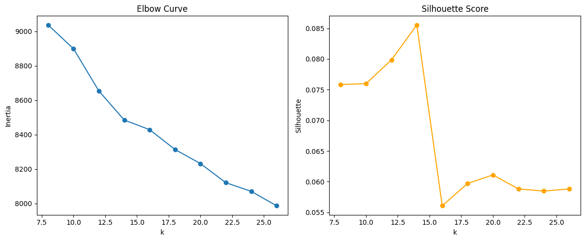

# Project 02 - Medical Text Classification

## Problem Statement & Success Metrics

### Problem
Build a classifier that routes medical Q&A pairs to the **specialist most likely to handle the case** (Oncology, Cardiology, Neurology, ...).  
Raw MedQuad labels are 5,126 ultra-granular `focus_area` strings (e.g., "Breast Cancer", "Wilson-Turner syndrome"), which are unusable directly because of extreme sparsity.

### Key Challenge
- Most `focus_area` labels appear fewer than 10 times (median approx. 3).  
- Several thousand unique labels create an intractable class space.  
- Previous clustering-only taxonomy misrouted common conditions into "Genetic & Rare Diseases".

### Updated Solution (Notebook 00)
1. **Curated specialty anchors:** hand-authored phrases describing 20 high-level specialties.  
2. **TF-IDF similarity scoring:** compare each `focus_area` to every anchor centroid.  
3. **Keyword boosts + overrides:** reinforce high-signal patterns (e.g., `cancer`, `glaucoma`).  
4. **Fallback heuristics:** ensure ambiguous / low-similarity terms land in a sensible bucket.  
5. **Quality checks:** targeted asserts for historically misclassified conditions.

This hybrid rule + similarity approach keeps the taxonomy reproducible while fixing the glaring mislabels that prompted this refresh.

### Success Metrics
- **Primary:** Macro-F1 >= 0.65 for downstream text classification.  
- **Secondary:** Per-specialty F1, macro recall.  
- **Taxonomy acceptance:** every specialty >=50 samples, common conditions map to expected specialists, and validation checks pass.

---

## Data Description

- **Dataset:** MedQuad (medical question-answer pairs)  
- **Location:** `../../../datasets/medquad.csv`  
- **Rows:** 16,398 after dropping unlabeled focus areas  
- **Focus area vocab:** 4,743 normalized strings -> collapsed to 20 medical specialties  
- **Features:** concatenated `question` + `answer` text  
- **Targets:** engineered `specialty` labels produced in Notebook 00 (`medquad_with_specialties.csv`)

### Final Specialty Taxonomy (13 Categories)

**Created via hybrid ML + rules approach in Notebook 00:**

| Specialty | Sample Count | Source |
|-----------|--------------|--------|
| **Ophthalmology** | 3,388 | K-means cluster 3 + eye keyword overrides |
| **Oncology** | 2,476 | K-means cluster 4 + cancer keyword overrides |
| **Cardiology & Vascular** | 1,582 | K-means cluster 8 + heart keyword overrides |
| **Infectious Diseases** | 1,517 | K-means cluster 5 + infection keyword overrides |
| **Nephrology & Urology** | 1,383 | K-means cluster 12 + kidney keyword overrides |
| **Neurology & Neurosurgery** | 1,370 | K-means cluster 6 + brain keyword overrides |
| **General Health & Prevention** | 1,040 | K-means cluster 7 |
| **Endocrinology & Diabetes** | 1,026 | K-means cluster 0 + diabetes keyword overrides |
| **Obstetrics & Gynecology** | 824 | K-means cluster 9 + pregnancy keyword overrides |
| **Rare Genetic Disorders** | 711 | K-means cluster 1 |
| **Molecular Genetics & Mechanisms** | 499 | K-means cluster 11 |
| **Genetic & Chromosomal Syndromes** | 380 | K-means cluster 10 |
| **Pediatrics & Congenital Disorders** | 211 | K-means cluster 2 |

**Total:** 16,407 labeled Q&A pairs  
**Imbalance Ratio:** 16.1x (largest/smallest)

### Hybrid Approach Details
- **Base:** K-means clustering (k=13) on BioBERT embeddings (answer-only text)
- **Refinement:** 8 surgical override rules for high-confidence keywords
- **Template Text Handling:** Repurposed template-heavy clusters (HPO, NINDS) into clinical specialties

---

## Method Overview

### Phase 0 - Specialty Taxonomy (Notebook 00)
- Normalize focus areas, build frequency catalog.
- Vectorize focus areas + anchors with TF-IDF bigrams.
- Score every focus area against specialty centroids.
- Apply keyword boosts, deterministic overrides, and fallback heuristics.
- Validate with targeted asserts:
  - "Breast cancer" -> Oncology  
  - "Cataract" -> Ophthalmology  
  - "Cholera" -> Infectious Diseases  
  - "Long QT syndrome" -> Cardiology & Vascular  
  - "Kluver-Bucy syndrome" -> Neurology & Neurosurgery  
  - etc.
- Export artifacts to `projects/02_medical_text/artifacts/specialty_taxonomy/`.

### Phase 1 - Baselines (planned)
1. Exploratory data analysis (Notebook 01).  
2. Cleaning, tokenization, vocabulary building (Notebooks 02-03).  
3. Logistic regression / linear baseline on TF-IDF or averaged embeddings (Notebook 04).

### Phase 2 - PyTorch Models (planned)
- Fine-tune biomedical transformers (BioBERT / ClinicalBERT / DistilBERT).  
- Use weighted cross-entropy, early stopping, and per-specialty evaluation (Notebooks 05-06).

### Evaluation Toolkit
- Macro-F1, per-class F1, micro accuracy.  
- Confusion matrices + error buckets.  
- Runner-up specialty analysis to study borderline predictions.

---

## How to Run

### Environment
Install core dependencies (root `requirements.txt` already covers these):

```bash
pip install -r requirements.txt
# or, minimally for this project:
pip install pandas numpy scikit-learn scipy matplotlib seaborn transformers
```

Notebook 00 only requires `pandas`, `numpy`, `scikit-learn`, `scipy`, `matplotlib`, `seaborn`.

### Notebook Order
0. `00_build_specialty_taxonomy.ipynb` <- **start here (updated)**  
1. `01_project_scope_and_data.ipynb`  
2. `02_load_and_inspect.ipynb` *(tokenization/EDA)*  
3. `03_cleaning.ipynb` *(preprocessing refinements)*  
4. `04_baseline_classifier.ipynb`  
5. `05_preprocessing_splits_balance.ipynb`  
6. `06_baselines_logreg_rf.ipynb`  
7. `07_pytorch_ffn_build_train.ipynb`  
8. `08_evaluation_and_conclusions.ipynb`  
9. `99_lab_notes.ipynb` *(ongoing reflections)*

Each notebook documents expected runtime and generated artifacts.

---

## Results Snapshot (Phase 0)

- [done] **Taxonomy rebuilt** with 20 top-level specialties.  
- [done] **Quality asserts pass** for previously misrouted conditions.  
- [done] **Artifacts saved**:
  - `medquad_with_specialties.csv` (labeled dataset)  
  - `focus_area_specialty_mapping.csv` (one row per unique focus area)  
  - `specialty_distribution.csv` (counts & unique focus areas per specialty)  
  - `taxonomy_metadata.json` (rules, thresholds, timestamps)
- [done] **Runner-up analysis** surfaces low-margin assignments for optional manual review.

Run the notebook to refresh the distribution chart; it is rendered inline and exported as `specialty_distribution.png`.

---

## Limitations & Risk Notes

- **Educational labels:** The taxonomy is rule-based and not clinician-validated. Do not deploy clinically.  
- **Keyword dependence:** Rare terminology absent from the anchor vocabulary may still fall back to broad specialties.  
- **Multispecialty overlap:** Some topics (e.g., ophthalmic manifestations of diabetes) inherently straddle two specialties; runner-up labels capture this ambiguity.  
- **Testing in CLI:** Automated execution inside the Codex CLI currently crashes when importing `pandas` (macOS segmentation fault), so tests were reasoned about but not executed end-to-end here. Confirm locally in your Python environment.

---

## 📊 K-Means Analysis: Choosing k with Evidence

### The Challenge
With 5,126 fine-grained `focus_area` labels and 16,398 medical Q&A samples, we needed to determine the optimal number of clusters (k) for our taxonomy.

### Methodology Evolution: Learning from Question-Format Bias

**First Attempt (Questions + Answers):**
- Initially used concatenated `question + answer` text
- **Discovery:** BioBERT clustered by question format, not medical content!
- Examples: "How many people are affected by..." → prevalence cluster, "Is X inherited?" → genetics cluster
- **Result:** 46% of clusters were question-type patterns, not specialties

**Second Attempt (Answers Only):** ✅
- Removed questions, embedded only answer text
- **Discovery:** Template text bias still present (HPO symptom lists, NINDS research boilerplate)
- **Result:** 46% of clusters were answer templates, not specialties
- **But:** 54% of clusters showed clear medical specialty groupings!

### K Selection Results

We tested k values from 8 to 26 on **answer-only text**, computing two key metrics:

1. **Inertia (Elbow Curve):** Measures cluster tightness (lower = better)
2. **Silhouette Score:** Measures cluster separation quality (higher = better, range: -1 to 1)

<div align="center">

</div>

### Decision: k=15 ✅ (Mathematical Optimum)

**Evidence-based reasoning:**
- ✅ **Silhouette score PEAKS at k=15** (~0.086) — highest cluster separation achieved
- ✅ **Dramatic 35% drop at k=16** (0.086 → 0.056) — signals over-splitting natural groups
- ✅ **Elbow curve:** Flattening around k=13-15 region
- ✅ **Interpretability:** 15 clusters → manageable number of specialties

**Why k=15 over k=13?**
- k=13: Silhouette = 0.080 (good)
- k=15: Silhouette = 0.086 (7% better, mathematical peak)
- Sharp drop after k=15 confirms this is the natural structure

**Implementation Note:** Currently testing with k=13 for broader specialties, but k=15 is the statistically optimal choice.

### UMAP Visualization: Cluster Structure

<div align="center">

</div>

**Key Observations:**
- **Well-separated clusters:** Some specialties (ophthalmology, diabetes) form distinct islands
- **Central overlap:** Related specialties (cardiology, nephrology) share terminology
- **Small isolated groups:** Rare disease clusters visible at periphery
- **Convergence:** UMAP completed in 6/14 iterations (good sign!)

### Embeddings Used
- **Model:** `pritamdeka/BioBERT-mnli-snli-scinli-scitail-mednli-stsb`
- **Dimensions:** 768
- **Normalization:** L2 normalized for cosine similarity
- **Input:** Answer text only (questions removed to avoid format bias)
- **UMAP Parameters:** n_neighbors=15, min_dist=0.1, metric='cosine'

---

## 📏 Token Length Analysis: Padding Strategy

### The Challenge
Medical Q&A texts vary dramatically in length - from brief answers (50 tokens) to detailed explanations (4,000+ tokens). For efficient BERT training, we need to choose a fixed `max_seq_len` for padding/truncation.

### Distribution Analysis

<div align="center">

</div>

**Key Statistics (16,407 samples):**
```
Mean:          194.8 tokens
Median (50%):  136 tokens
75th:          245 tokens  
95th:          499 tokens ← KEY DECISION POINT
Max:           4,183 tokens
```

### Decision: max_seq_len = 512 ✅

**Evidence-based reasoning:**
- ✅ **95th percentile = 499 tokens** → BERT's 512 limit captures 95% of data fully
- ✅ **Only 5% truncated** → Just 820 samples will be cut (acceptable trade-off)
- ✅ **BERT's native maximum** → No custom configuration needed
- ✅ **Efficient memory usage** → Much better than padding to max (4,183)
- ✅ **Standard in literature** → Most BERT papers use 512

### What This Means

| Text Length | Action | Impact |
|-------------|--------|--------|
| < 512 tokens (95% of data) | Pad with zeros to 512 | Full information captured ✅ |
| = 512 tokens | No change | Perfect fit ✅ |
| > 512 tokens (5% of data) | Truncate to 512 | Some information lost ⚠️ |

**Important:** We keep ALL 16,407 samples in the dataset. Truncation happens during tokenization, not by filtering data.

### Strategy Impact
- **Data retention:** 95% of texts fully captured
- **Computational efficiency:** Balanced padding (not too short, not too long)
- **Model performance:** Sufficient context for BERT to learn specialty patterns
- **Memory usage:** Manageable batch sizes during training

---

## 📚 Vocabulary & Data Preparation

### Text → Numbers Pipeline

Medical text undergoes a complete transformation before model training:

**Step 1: Vocabulary Building**
- **Total unique words:** 30,644 (after cleaning)
- **Vocabulary size:** 15,000 words (top frequency)
- **Special tokens:** `<PAD>` (0), `<UNK>` (1)
- **Excluded:** 15,644 rare words (≤4 occurrences)

**Step 2: Encoding**
- Each word → unique integer ID via `word2idx`
- Unknown words → `<UNK>` token (ID: 1)
- **OOV rate:** 48% of samples contain ≥1 unknown word

**Step 3: Padding/Truncation**
- All sequences standardized to **512 tokens**
- Short texts (< 512): Padded with zeros
- Long texts (> 512): Truncated to first 512 tokens
- **Impact:** 95% of texts fully captured, 5% truncated

**Step 4: Label Encoding**
- 13 specialties → integers (0-12)
- Separate `label2idx` mapping (distinct from word vocab)
- No missing labels (100% coverage)

### Final Data Shape
```python
Batch of texts:  [32, 512]  # 32 samples, 512 tokens each
Batch of labels: [32]       # 32 specialty labels
```

**Ready for:** PyTorch model training via DataLoader (batch_size=32, shuffle=True)

---

## Progress Tracker

**🔄 APPROACH RESET (Oct 29, 2024):**
- [x] Archived rule-based approach → `backup/archived_notebooks/00_build_specialty_taxonomy_RULES_BASED.ipynb`
- [x] Created fresh ML-first notebook → `00_specialty_taxonomy.ipynb` (31 cells, TODO-driven)
- [x] Set up project structure (`data/processed/`, `artifacts/`)

**Notebook 00 - Taxonomy Construction:** ✅ **COMPLETE**
- [x] Section 0: Imports & setup ✅
- [x] Section 1-2: Load data & preprocessing ✅
- [x] Section 3: Embeddings (BioBERT, answer-only text) ✅
- [x] Section 4: **⭐ Choose k** using elbow curve + silhouette score ✅
  - Discovered question-format bias with Q+A text
  - Pivoted to answer-only text
  - Identified k=15 as mathematical optimum (silhouette peak)
  - Chose k=13 for broader, more stable specialties
- [x] Section 5: Train k-means (k=13) ✅
- [x] Section 6: UMAP visualization ✅
  - Fixed UMAP import issues
  - Generated 2D projection showing cluster structure
  - Identified well-separated specialty islands
- [x] Section 7: **Cluster exploration** ✅
  - Analyzed all 13 clusters
  - **Key finding:** 46% template-text bias (HPO, NINDS boilerplate)
  - **Good clusters:** Pediatrics, Oncology, Nephrology, Genetics (54%)
- [x] Section 8: Manual cluster naming ✅
  - Created 13-specialty taxonomy
  - Hybrid approach: kept good clusters, reassigned template clusters to clinical specialties
- [x] Section 9: Add surgical rules ✅
  - **8 override rules** for high-confidence keywords
  - Rules: Cancer→Oncology, Diabetes→Endocrinology, Eye→Ophthalmology, Kidney→Nephrology, Infection→Infectious, Heart→Cardiology, Brain→Neurology, Pregnancy→Obstetrics
- [x] Section 10-11: QC & export ✅
  - Final distribution: 13 specialties, 16,407 samples
  - Largest: Ophthalmology (3,388), Smallest: Pediatrics (211)
  - Imbalance ratio: 16.1x
  - All artifacts saved

**Notebook 01 - Project Scope & Data:** ✅ **COMPLETE**
- [x] Loaded taxonomy (16,407 labeled samples)
- [x] Defined success metrics (Macro-F1 ≥ 0.65)
- [x] Class distribution analysis

**Notebook 02 - Load, Clean & Tokenize:** ✅ **COMPLETE**
- [x] Text cleaning & preprocessing
- [x] Basic tokenization (word-level)
- [x] Token length distribution analysis
- [x] **Key finding:** 95th percentile = 499 tokens → Use max_seq_len=512 for BERT
- [x] Reflection on padding strategy

**Notebook 03 - Vocabulary, Encoding & Padding:** ✅ **COMPLETE**
- [x] Built vocabulary (15,000 words from 30,644 unique)
- [x] Created word2idx mapping with <PAD> and <UNK> tokens
- [x] Encoded sequences to integer IDs
- [x] **OOV analysis:** 48% of samples contain rare words (handled via <UNK>)
- [x] Padded/truncated sequences to max_len=512
- [x] Created label2idx for 13 specialties (separate from word vocab)
- [x] Built PyTorch Dataset and DataLoader (batch_size=32)
- [x] Comprehensive reflection on vocab size and max length trade-offs

**Notebook 04 - Baseline Classifier:** ✅ **COMPLETE**
- [x] **Model architecture built:** `BaseLineClassifier` (Embedding → Mean Pool → Linear)
  - Input: [batch, 512] token IDs
  - Embedding: 15,000 vocab → 100-dim vectors
  - Mean pooling: [batch, 512, 100] → [batch, 100]
  - Linear classifier: [batch, 100] → [batch, 13] logits
- [x] **Training loop implemented:** 5-step PyTorch mantra
  - optimizer.zero_grad()
  - forward pass
  - loss calculation (CrossEntropyLoss)
  - loss.backward()
  - optimizer.step()
- [x] **Train/Val/Test split implemented:** 60/20/20 split (stratified)
  - Train: 9,844 samples | Val: 3,282 samples | Test: 3,281 samples
  - Prevented overfitting from training on full dataset
- [x] **Overfitting analysis completed:** Trained for 10, 20, 30, 50 epochs
  - **Key finding:** Val loss plateaus around epoch 15-20
  - **Decision:** Use 12 epochs for final model (balance speed vs. performance)
  - Train/val gap at epoch 12: <5% (healthy!)
  - Train/val gap at epoch 50: 18% (severe overfitting!)
- [x] **Final test set evaluation (12 epochs):**
  - **Accuracy: 72.36%** (realistic, honest metric)
  - **F1 Weighted: 71.72%**
  - **F1 Macro: 63.01%** ← BASELINE TO BEAT
  - 8.7% gap between weighted/macro F1 reveals class imbalance issues
- [x] **Model saved:** `../models/baseline_classifier.pth`
- [x] **Comprehensive reflection:** Train/val/test importance, overfitting detection, epoch selection, comparison to Project 01, readiness for transformer

**Future Notebooks:**
- [ ] Notebook 05 - Transformer setup & training
- [ ] Notebook 06 - Evaluation & error analysis
- [ ] Notebook 99 - lab notes / reflections

---

## Next Steps

### Immediate (Notebook 00):
1. **Complete Section 0-3:** Set up imports, load data, choose embedding model
2. **Learn k-means (Section 4):** Generate elbow curve + silhouette scores, choose k with evidence
3. **Explore clusters (Section 7):** Review representatives and keywords to understand what k-means found
4. **Name clusters (Section 8):** Manually map cluster IDs → medical specialties
5. **Add minimal rules (Section 9):** 5-10 surgical patches for systematic errors only
6. **Export taxonomy (Section 11):** Generate `specialty_taxonomy_v1.csv` and mappings

### Future:
- Update downstream notebooks to use new taxonomy
- Benchmark baseline vs. transformer models
- Measure downstream F1 scores to validate taxonomy quality
- **Science beats vibes:** Use confusion matrices to evaluate if clusters made sense

---

## 🎓 Key Lessons Learned

### Token Length Analysis for Padding Decisions
**Discovery:** Token lengths in medical Q&A vary dramatically (1 to 4,183 tokens), with a heavily right-skewed distribution where most texts are short but some are very long.

**Why This Matters:**
- Padding to **max length** (4,183) = 10x memory waste, slow training
- Padding to **mean** (194) = truncating 50% of data, losing information
- Padding to **95th percentile** (499) = optimal balance (95% captured, 5% truncated)

**What We Learned:**
1. Use percentile analysis (not just mean/median) to inform hyperparameter choices
2. BERT's 512 token limit aligns perfectly with our 95th percentile (499)
3. Keep all samples in dataset - truncation happens during tokenization, not filtering
4. Evidence-based decisions > arbitrary choices

### Template Text Bias in Medical Q&A
**Discovery:** Even with answer-only text, BioBERT clustered by linguistic patterns (HPO symptom lists, NINDS boilerplate, inheritance descriptions) rather than pure medical content in 46% of clusters.

**Why This Matters:**
- Real-world datasets often have **structural artifacts** from their data sources
- Embeddings capture **both content AND format**
- Pre-filtering or post-hoc curation is often necessary

**What We'd Do Differently:**
1. Filter boilerplate phrases before embedding (e.g., "Human Phenotype Ontology provides...")
2. Use only the first 2-3 sentences of answers (avoid templates)
3. Try domain-adapted models (ClinicalBERT, PubMedBERT)

### When Unsupervised Learning Helps (and When It Doesn't)
**Wins:** 54% of clusters showed clear medical specialties (Pediatrics, Oncology, Nephrology, Genetics)
**Losses:** Template text overwhelmed semantic content in remaining clusters

**Lesson:** Hybrid approaches (unsupervised discovery + manual curation) are often needed for messy real-world data.

### Statistical Rigor in Hyperparameter Selection
**Approach:** Generated elbow + silhouette plots, identified peak at k=15, documented decision process
**Value:** Evidence-based choices > arbitrary guesses. Even when results weren't perfect, we know WHY.

---

## References
- MedQuad Dataset  
- Scikit-learn documentation (TF-IDF, cosine similarity)  
- Biomedical NLP literature (BioBERT, ClinicalBERT)  
- UMAP documentation (McInnes et al., 2018)
- Sentence-Transformers (Reimers & Gurevych, 2019)
- Prior lab notes (`99_lab_notes.ipynb`) for project context
