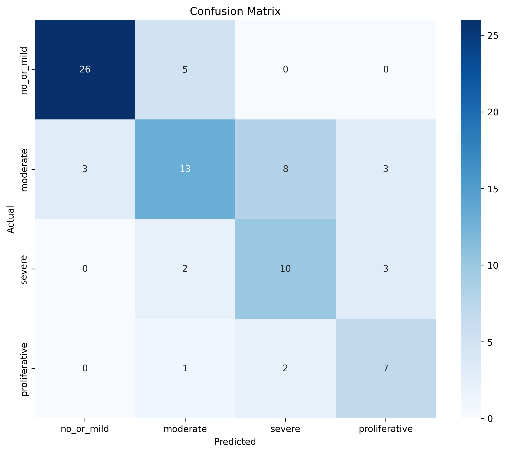

# Project 03: Retinal Diabetic Retinopathy Detection

## Problem Statement & Success Metrics

### Problem
Classify retinal fundus images by diabetic retinopathy (DR) severity levels (0-4).

### Questions to Explore
- Can a pretrained CNN backbone achieve reasonable DR classification?
- What are the optimal image augmentations?
- How do different architectures compare?

### Success Metrics
- **Primary:** Weighted-F1 ≥ 0.70
- **Secondary:** Per-class F1 scores
- **Clinical:** Screening vs diagnostics threshold analysis

---

## Data Description

### Source
- **Dataset:** IDRiD (Indian Diabetic Retinopathy Image Dataset)
- **Location:** `../data/diabetic_retinopathy_images/`
- **Size:** ~500+ retinal images

### Key Fields
- **Target:** DR Severity (0-4)
  - 0: No DR
  - 1: Mild DR
  - 2: Moderate DR
  - 3: Severe DR
  - 4: Proliferative DR
- **Features:** Retinal fundus images (RGB)
- **Type:** Image (JPG)

### Target Distribution
- Check notebook `01_project_scope_and_data.ipynb` for class balance
- Expect severe imbalance (most cases are No DR or Mild)

---

## Method Overview

### Baseline Model
1. **Transfer-learned ResNet18** — ImageNet backbone with dropout + linear head (4 classes)

### PyTorch Model
- **Architecture:** ResNet18 + dropout head (optionally freeze backbone)
- **Training:** CrossEntropyLoss w/ class weights, AdamW optimizer, StepLR scheduler
- **Augmentation:** RandomResizedCrop, flips (H/V), ColorJitter; eval uses Resize+CenterCrop
- **Sampling:** WeightedRandomSampler to oversample rare grades in each epoch

### Evaluation
- **Metrics:** Weighted-F1, per-class F1, Accuracy
- **Visualizations:** Confusion Matrix, Training Curves
- **Optional:** Threshold sweep for screening use case

---

## How to Run

### Prerequisites
- Complete root-level setup (see main README)
- Install torchvision: `pip install torchvision`

### Notebook Order
1. `01_project_scope_and_data.ipynb` — Define problem & metrics
2. `02_transforms_and_loaders.ipynb` — Image transforms & DataLoaders
3. `03_simple_cnn_scaffold.ipynb` — Earlier scratch CNN experiments (kept for reference)
4. `04_train_validate_metrics.ipynb` — ResNet18 training loop, weighted sampling, metrics
5. `05_test_eval_and_thresholding.ipynb` — Final evaluation + confusion matrix
6. `99_lab_notes.ipynb` — Reflections (ongoing)

### Progress Notes
- **Notebook 04 (Training & validation):**
  - Swapped scratch CNN for **ResNet-18** with Imagenet weights (backbone frozen, new classifier head)
  - Stratified train/val/test split after merging class 1→0; class-weighted loss + early stopping (patience=5)
  - ResNet head converged in ~18 epochs (**val acc ≈ 0.60, macro-F1 ≈ 0.61**)
  - Training curves: `images/training_validation_metrics.png`
- **Notebook 05 (Evaluation):**
  - ResNet head on held-out test set → **accuracy 0.67, weighted-F1 0.68, macro-F1 0.65**
  - Confusion matrix now shows balanced recall across all four severity buckets (`images/confusion_matrix.png`)
  - Documented why transfer learning recovers rare classes vs the scratch CNN baseline

### Expected Outputs
- **Data:** Preprocessed images with augmentations
- **Model:** Trained CNN
- **Metrics:** Test set performance
- **Visualizations:** Confusion matrix, training curves

---

## Results Snapshot

| Model | Weighted-F1 | Accuracy | Notes |
|------|-------------|----------|-------|
| ResNet18 (pretrained, frozen backbone) | 0.68 | 0.67 | Macro-F1 0.65; all classes ≥0.48 recall |

### Key Findings
- Transfer learning (ResNet-18) lifted macro-F1 from 0.31 → 0.65 compared to the scratch CNN baseline.
- Class weighting + pretrained filters finally gave `severe` & `proliferative` recall ≥0.67; confusion no longer collapses into class 1.
- Dataset remains tiny/imbalanced—fine-tuning deeper blocks, focal loss, and retina-specific augments are the next levers.

### Operating Threshold
- **Chosen threshold:** Softmax argmax (no threshold sweep yet)
- **Rationale:** First transferred baseline exceeds 0.65 macro-F1; will revisit thresholds after deeper fine-tuning.

---

## Limitations & Ethics

### Data Limitations
- Small dataset may limit generalization
- Single imaging device/scanner
- Possible annotation inconsistencies
- Geographic bias (Indian population)

### Model Limitations
- Not validated on external cohorts
- Pretrained ResNet-18 still misclassifies moderate vs severe edges
- No explainability (attention maps)

### Confusion Matrix

### Ethical Considerations
- **Do not use for clinical diagnosis**
- False negatives in severe DR are dangerous
- False positives cause patient anxiety
- Screening vs diagnostics contexts differ
- Population bias considerations

---

## Next Steps

- [x] Transfer learning with pretrained ResNet/EfficientNet (ResNet18 in place; monitor performance)
- [x] Experiment with different augmentations (RandomResizedCrop + ColorJitter, flips)
- [x] Address imbalance with sampling/weighted loss
- [ ] Add Grad-CAM for explainability
- [ ] Ensemble methods
- [ ] Cross-validation for robust metrics
- [ ] Focus on detecting severe cases (grouping 3+4)

---

## References

- IDRiD Dataset: https://ieee-dataport.org/open-access/indian-diabetic-retinopathy-image-dataset-idrid
- Diabetic Retinopathy Detection Literature
- PyTorch Vision Documentation
